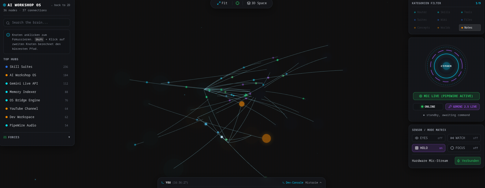
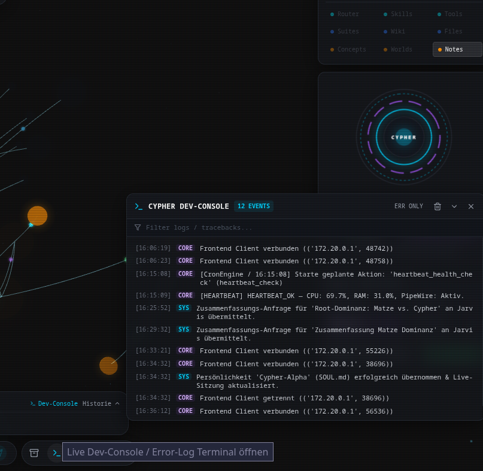

[🇩🇪 Zur deutschen Dokumentation wechseln](README_DE.md) | [🇬🇧 Switch to English Documentation](README.md)

# J.A.R.V.I.S. AI OS — Desktop WebGL Edition (Cypher)

<p align="center">
  
  <br><br>
  
</p>

[](https://github.com/Graba92/webjarvis)
[](https://cachyos.org)
[](https://python.org)
[-black?logo=next.js)](https://nextjs.org)
[](https://threejs.org)
[](https://aistudio.google.com)
[](https://pipewire.org)
[](#-mcp-ecosystem-model-context-protocol)
[](LICENSE)

> **J.A.R.V.I.S. (Codename: Cypher)** is an autonomous, lean, multimodal desktop AI Operating System specifically tailored for CachyOS and Arch Linux. It features bi-directional low-latency voice streaming via Gemini Live (WebSockets), dedicated PipeWire virtual audio sink routing, dynamic AI identity synchronization, full-featured relational calendar scheduling with conversational slot-filling, deterministic action-auditing with backend receipts, resilient WebSocket reconnection backoff, a hardware safety confirmation gate, consistent `VACUUM INTO` live SQLite backups, a hermetic Bubblewrap sandbox, and a 3D WebGL holographic HUD (Three.js & Next.js 15).

---

## 📑 Table of Contents
1. [System Architecture & Data Flow](#-system-architecture--data-flow)
2. [Identity & Configuration Triad (`SOUL.md`, `MEMORY.md`, `HEARTBEAT.md`)](#-identity--configuration-triad)
3. [Dynamic AI Identity & Live HUD Parity](#-dynamic-ai-identity--live-hud-parity)
4. [Bidirectional Calendar Engine & Conversational Slot-Filling](#-bidirectional-calendar-engine--conversational-slot-filling)
5. [Action-Auditing, Backend Receipts & Telemetry Throttling](#-action-auditing-backend-receipts--telemetry-throttling)
6. [Native CachyOS Skills & Tool Matrix](#-native-cachyos-skills--tool-matrix)
7. [Performance, Audio Routing & Privacy](#-performance-audio-routing--privacy)
8. [Data Integrity, Atomic Writes & VACUUM INTO Backups](#-data-integrity-atomic-writes--vacuum-into-backups)
9. [Developer Tools, Live Dev-Console & Personality Wizard](#-developer-tools-live-dev-console--personality-wizard)
10. [3D WebGL Holographic HUD & Theme Engine](#-3d-webgl-holographic-hud--theme-engine)
11. [MCP Ecosystem (Model Context Protocol)](#-mcp-ecosystem-model-context-protocol)
12. [Quickstart & Master Orchestrator (`start.sh`)](#-quickstart--master-orchestrator-startsh)
13. [License & Author](#-license--author)

---

## 🏛️ System Architecture & Data Flow

```
                                  ┌────────────────────────┐
                                  │   Google Gemini Live   │
                                  │  Bi-directional Stream │
                                  └───────────▲────────────┘
                                              │ (Audio in/out & Function Calls)
                                              ▼
                                  ┌────────────────────────┐
                                  │   Python Core Server   │
                                  │      (server.py)       │
                                  │   Port 8765 (WebSocket)│
                                  └───────────▲────────────┘
                                              │
                         ┌────────────────────┼────────────────────┐
                         │                    │                    │
                         ▼                    ▼                    ▼
               ┌───────────────────┐┌───────────────────┐┌───────────────────┐
               │ CachyOS Skills    ││  Hybrid Memory    ││  MCP Gateway      │
               │ - update_agent.py ││ - calendar.db     ││ (Brave Search,    │
               │ - calendar_mgr.py ││   (WAL + Relational││  Fetch, Custom    │
               │ - confirm.py Gate ││ - LanceDB Vector  ││  JSON-RPC 2.0)    │
               │ - ActionDispatch  ││ - long_term.json  ││                   │
               └───────────────────┘└───────────────────┘└───────────────────┘
                         │                    │                    │
                         ▼                    ▼                    ▼
               ┌───────────────────┐┌───────────────────┐┌───────────────────┐
               │ PipeWire Audio    ││ Proactive Cron    ││ VACUUM INTO Backup│
               │ Dedicated Sink    ││ Morning Briefing  ││ Online Snapshot / │
               │ Paranoia Kill     ││ Focus Mode Pause  ││ Restore Manager   │
               └───────────────────┘└───────────────────┘└───────────────────┘
                                              │
                                              │ 60Hz Rate-Limited Telemetry, RMS,
                                              │ CALENDAR_SYNC, ACTION_RECEIPT,
                                              │ SYSTEM_INIT & dev_log Events
                                              ▼
                                  ┌────────────────────────┐
                                  │   Next.js 15 App HUD   │
                                  │  Three.js WebGL Engine │
                                  │  ActionAuditor Tracker │
                                  │  Port 3000 (React 19)  │
                                  └────────────────────────┘
```

---

## 🧬 Identity & Configuration Triad

J.A.R.V.I.S. is driven by three transparent Markdown configuration documents located in `backend/`:

1. **`SOUL.md` (Persona, Tone & Core Behavioral Directives):**
   Defines the identity, concise and dry communication style, technical precision, and behavioral boundaries. Can be edited manually or live via the **Personality Wizard** in the HUD.
2. **`MEMORY.md` (Long-Term User Models & Epistemic Facts):**
   Maintains user preferences, workflows, hardware specs, and persistent knowledge without hardcoded identities.
3. **`HEARTBEAT.md` (Autonomous Periodic Scheduler):**
   Governs autonomous background routines (e.g. system health checks, calendar sweeps, CachyOS package scans, and morning briefings).

---

## 🎭 Dynamic AI Identity & Live HUD Parity

- **Single Source of Truth (`SOUL.md` / `config.py`):**
  The assistant identity (`ai_name`) is dynamically parsed from `SOUL.md` or the `JARVIS_AI_NAME` environment variable.
- **Real-Time Live Synchronization:**
  During the initial handshake (`init` / `SYSTEM_INIT`) and upon personality updates (`save_personality`), the active name is transmitted to all connected HUD instances.
- **Reactive Visualizer & Console Binding:**
  The central Arc-Reactor center badge (`AgentCockpit.tsx`) and the floating developer console (`DevConsole.tsx`) dynamically update their labels and font tracking in real-time without requiring frontend refreshes.

---

## 📅 Bidirectional Calendar Engine & Conversational Slot-Filling

- **Relational SQLite Schema (`calendar_events`):**
  Stores events with unique UUIDs, ISO-8601 timestamps, recurrence rules (`DAILY`, `WEEKLY`, `MONTHLY`), and structured multi-tier reminder strategies in JSON format (`reminder_strategy`).
- **Conversational Slot-Filling Directives:**
  When asking Jarvis to schedule appointments, the assistant interactively fills missing slots (date, time, recurrence, notification lead time) and summarizes all details before confirming and invoking the `create_calendar_entry` tool.
- **Event-Driven Live-Sync (`CALENDAR_SYNC`):**
  Database changes instantly emit `CALENDAR_SYNC` WebSocket broadcasts to all connected frontends, refreshing the calendar UI in real-time.
- **HUD Calendar Dashboard & Shortcut (`Alt+C`):**
  A dedicated cyber-glass modal allows full manual inspection, quick filters ("In 1h", "Morgen 09:00"), natural language inputs, and single-click event deletion.

---

## ⚡ Action-Auditing, Backend Receipts & Telemetry Throttling

- **ActionAuditor Engine (`frontend/utils/auditLogger.ts`):**
  Guarantees that every user interaction dispatched from the HUD (killswitch, manual calendar creation, update checks, backups) receives a verified correlation ID and is acknowledged by an `ACTION_RECEIPT` packet from the Python core. Prevents silent UI stalls or zombie button states.
- **60 Hz Telemetry & RMS Throttling:**
  Incoming audio RMS levels and hardware sensor data are capped to a strict 60 Hz frame budget (~16.6 ms) on the WebSocket bridge, preventing JavaScript event loop congestion and garbage-collection spikes in Three.js.
- **Resilient Reconnection with Exponential Backoff & Jitter:**
  Frontend reconnect logic scales gracefully (`1s * 1.8^n` up to 15s) with random jitter (0–500 ms), completely avoiding thundering-herd reconnect storms upon backend restarts.

---

## 🐧 Native CachyOS Skills & Tool Matrix

All autonomous skills are located in `backend/actions/` and registered with the Gemini Live Action Registry:

- **CachyOS Update Agent (`update_agent.py`):**
  Monitors pending package upgrades via `checkupdates` and `yay -Qu`. Specifically isolates critical system components (`linux`, `linux-cachyos`, `systemd`, `glibc`, `nvidia`, `mesa`, `openssl`). Never executes unconfirmed package upgrades: strictly routes through the Hardware Confirmation Gate (`confirm.py`).
- **Hardware Confirmation Gate (`computer_settings.py` & `core/confirm.py`):**
  Destructive system commands (shutdown, reboot, sleep) trigger an amber confirmation banner in the HUD with a 90-second countdown, requiring deliberate physical or UI verification before execution.
- **Hermetic Bubblewrap Sandbox (`sandboxed_shell.py` & `file_controller.py`):**
  Executes shell operations in a strictly isolated namespace (`bwrap`), mounting system libraries read-only and scoping write access exclusively to `backend/sandbox_workspace/`.
- **Optimistic Undo-Stack Engine (`undo_action.py` & `core/undo.py`):**
  A 10-level transaction memory with differential snapshots allowing instant rollback (`undo_last_action`) of accidental file mutations or configuration changes.
- **Dual-Tier Memory Search (`recall_memory.py` & `memory/memory_manager.py`):**
  Enables on-demand fuzzy searching across the user's long-term memory archive without inflating the active LLM context window.
- **Desktop Application Launcher (`open_app.py`):**
  Spawns Wayland and KDE Plasma native desktop applications (e.g. Konsole, Dolphin, Kate, Brave) with proper session detachment.
- **Proactive Morning Briefing (`core/cron_engine.py`):**
  Autonomously triggers at 08:00 or system boot, summarizing appointments, pending package updates, and system metrics via PipeWire voice playback.

---

## 🔊 Performance, Audio Routing & Privacy

- **Dedicated PipeWire Virtual Sink (`cypher_ai_sink`):**
  Jarvis registers as an independent audio node (`Cypher AI Audio`) within PipeWire and PulseAudio emulation. It appears as an individual volume slider in the KDE Plasma System Tray Audio Mixer, allowing independent balance without altering system audio.
- **Paranoia Killswitch (Hardware-Level Microphone Cut):**
  A dedicated toggle in the HUD that immediately terminates and closes the ALSA/PipeWire input stream handle. When activated, the HUD displays a bright red `PARANOIA MUTED (HARDWARE-OFF)` alert.
- **Focus Mode (Zero-Interference Gaming & Compilation):**
  Temporarily halts all background cron jobs and heartbeats with a single HUD click, freeing 100% CPU time for gaming, kernel compilation, or benchmark tasks.

---

## 🛡️ Data Integrity, Atomic Writes & VACUUM INTO Backups

- **Consistent Online SQLite Backups (`VACUUM INTO`):**
  Before packaging `calendar.db` into a backup archive, the system flushes the Write-Ahead Log (`PRAGMA wal_checkpoint(TRUNCATE);`) and generates an atomic, lock-free snapshot using `VACUUM INTO` in a temporary directory. Eliminates backup corruption caused by active WAL transactions.
- **SQLite Concurrency Hardening:**
  All database connections operate with `PRAGMA journal_mode=WAL;`, `PRAGMA synchronous=NORMAL;`, and `busy_timeout=10000;`, coupled with a safe context manager (`get_db()`) to prevent resource exhaustion and connection locks.
- **Atomic Two-Phase Memory Writes:**
  Writes to `long_term.json` utilize temporary file buffers (`NamedTemporaryFile`), forced OS synchronization (`os.fsync`), and atomic file replacement (`os.replace`) to guarantee absolute durability against abrupt power cuts or process kills.

---

## 🛠️ Developer Tools, Live Dev-Console & Personality Wizard

- **Live Dev-Console (`DevConsole.tsx`):**
  A collapsible floating terminal streaming unfiltered backend events, exceptions, tool invocations, and tracebacks directly over WebSockets (`dev_log`).
- **1-Click Brain Backup (`backup_manager.py` & `BottomDock.tsx`):**
  Exports all persistent data (`long_term.json`, `calendar.db`, LanceDB vector indices, `SOUL.md`, and `mcp_servers.json`) into an encrypted or unencrypted `.zip` archive.
- **Personality Wizard Modal (`PersonalityWizardModal.tsx`):**
  Interactive in-HUD wizard for configuring persona tone, humor, expertise domain, and ethical guardrails with 1-click live saving to `SOUL.md`.

---

## 🌐 3D WebGL Holographic HUD & Theme Engine

- **Three.js Knowledge Constellation (`ApexWorld.tsx`):**
  Interactive 3D graph with multi-colored data flow particles (`0x00d4ff`, `0x00ff88`, `0xa855f7`), reactive audio pulse scale, and Bezier link routing with full `.dispose()` memory cleanup on unmount.
- **Centralized Theme Config (`frontend/theme.json`):**
  Defines standardized color palettes and glowing borders tailored for Arch Linux and CachyOS desktop ricing.

---

## 🔌 MCP Ecosystem (Model Context Protocol)

J.A.R.V.I.S. implements standard Model Context Protocol (MCP) JSON-RPC 2.0 servers configured in `backend/config/mcp_servers.json`:
- **`brave_search`:** Privacy-focused web search replacing legacy scrapers.
- **`fetch`:** Efficient web content retrieval and markdown conversion.
- **Dynamic MCP GUI:** Toggle and configure new MCP servers directly in the HUD via the Skills Matrix.

---

## ⚡ Quickstart & Master Orchestrator (`start.sh`)

### 1. Clone & Setup
```bash
git clone https://github.com/Graba92/webjarvis.git
cd webjarvis
chmod +x setup.sh start.sh terminate_jarvis.sh
./setup.sh
```

### 2. Configure API Key
```bash
cp backend/.env.example backend/.env
# Enter your GEMINI_API_KEY into backend/.env (or configure interactively via ./start.sh)
```

### 3. Launch Options

#### Option A: Interactive Master Orchestrator
```bash
./start.sh
```
Interactive terminal menu options:
* `1)` **Gesamtsystem starten**: Boots Python Gemini Live WebSocket server & Next.js 15 HUD concurrently.
* `2)` **Nur Python Backend starten**: Starts WebSocket core on `ws://127.0.0.1:8765`.
* `3)` **Nur Next.js Frontend starten**: Starts Three.js 3D WebGL HUD on `http://localhost:3000`.
* `4)` **Hardware- & Systemprüfung ausführen**: Verifies PipeWire, ALSA audio sinks, bubblewrap sandbox & dependencies.
* `5)` **Gemini API Key konfigurieren**: Persistent interactive credential helper.
* `6)` **Beenden**: Gracefully shuts down subsystems.

#### Option B: Direct CLI Execution (Headless & Automation)
```bash
./start.sh --all        # Starts backend + frontend directly
./start.sh --backend    # Starts backend only
./start.sh --frontend   # Starts frontend only
./start.sh --check      # Runs system verification gates
./terminate_jarvis.sh   # Cleanly stops all background services and frees ports 8765 & 3000
```

#### Option C: Containerized (Docker Compose)
```bash
./docker-start.sh       # Builds & runs frontend + backend in isolated Docker containers
./docker-logs.sh        # Streams live container logs
./docker-stop.sh        # Stops all Docker containers
```

---

## 📜 License & Author

- **Author:** Graba92
- **License:** MIT License (Open Source)
