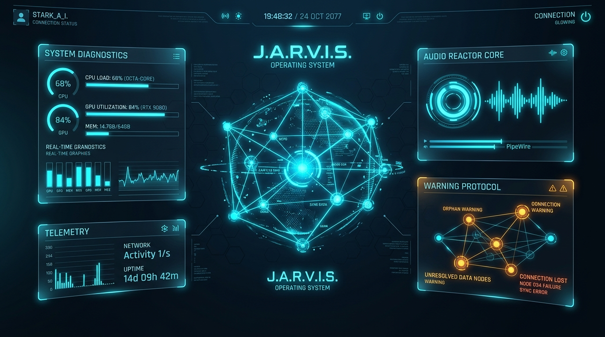
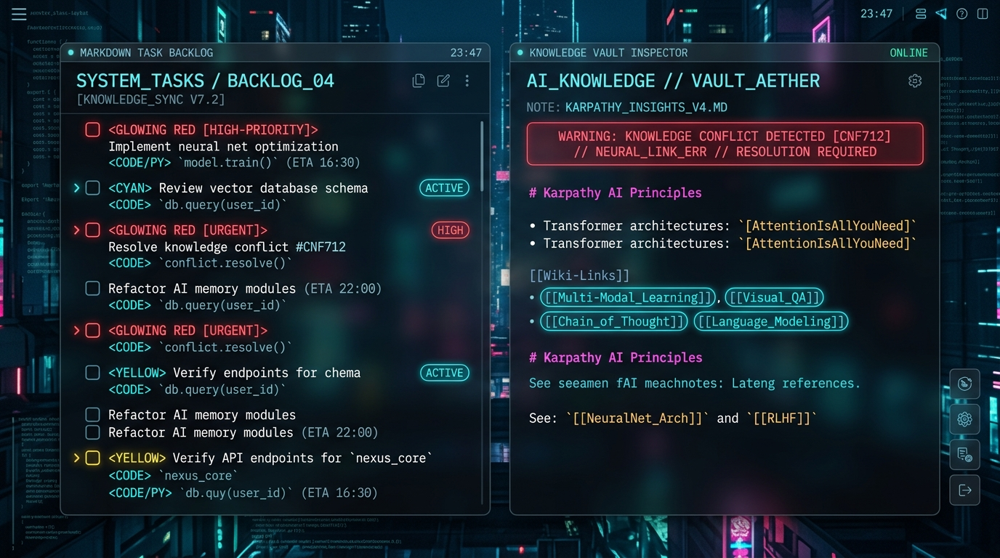
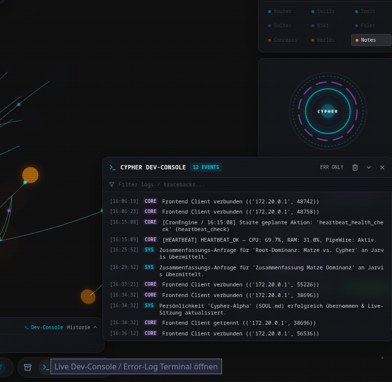

[🇩🇪 Zur deutschen Dokumentation wechseln](README_DE.md) | [🇬🇧 Switch to English Documentation](README.md)

# J.A.R.V.I.S. AI OS — Desktop WebGL Edition (Cypher)

<p align="center">
  
  <br><br>
  
  <br><br>
  
</p>

[](https://github.com/Graba92/webjarvis)
[](https://cachyos.org)
[](https://python.org)
[-black?logo=next.js)](https://nextjs.org)
[](https://threejs.org)
[](https://aistudio.google.com)
[](https://pipewire.org)
[](#-mcp-ecosystem-model-context-protocol)
[](LICENSE)

> **J.A.R.V.I.S. (Codename: Cypher)** is an autonomous, lean, multimodal desktop AI Operating System specifically tailored for CachyOS and Arch Linux. It features bi-directional low-latency voice streaming via Gemini Live (WebSockets), dedicated PipeWire virtual audio sink routing, dynamic AI identity synchronization, full-featured relational calendar scheduling with conversational slot-filling, deterministic action-auditing with backend receipts, resilient WebSocket reconnection backoff, a hardware safety confirmation gate, consistent `VACUUM INTO` live SQLite backups, a hermetic Bubblewrap sandbox, and a 3D WebGL holographic HUD (Three.js & Next.js 15).

---

## 📑 Table of Contents
1. [System Architecture & Data Flow](#-system-architecture--data-flow)
2. [Task Backlog Engine (`backlog.md` Single-Writer)](#-task-backlog-engine-backlogmd-single-writer)
3. [Karpathy-Pattern Knowledge Vault & [[Wiki-Links]]](#-karpathy-pattern-knowledge-vault--wiki-links)
4. [3D WebGL Holographic HUD & Settle-on-Equilibrium Physics](#-3d-webgl-holographic-hud--settle-on-equilibrium-physics)
5. [Interactive Wiki & Node Inspector (`WikiInspectorModal.tsx`)](#-interactive-wiki--node-inspector-modal)
6. [Identity & Configuration Triad (`SOUL.md`, `MEMORY.md`, `HEARTBEAT.md`)](#-identity--configuration-triad)
7. [Dynamic AI Identity & Live HUD Parity](#-dynamic-ai-identity--live-hud-parity)
8. [Bidirectional Calendar Engine & Conversational Slot-Filling](#-bidirectional-calendar-engine--conversational-slot-filling)
9. [Action-Auditing, Backend Receipts & Telemetry Throttling](#-action-auditing-backend-receipts--telemetry-throttling)
10. [Native CachyOS Skills & Tool Matrix](#-native-cachyos-skills--tool-matrix)
11. [Performance, Audio Routing & Privacy](#-performance-audio-routing--privacy)
12. [Hermetic Bubblewrap Sandbox & Security Architecture](#-hermetic-bubblewrap-sandbox--security-architecture)
13. [MCP Ecosystem (Model Context Protocol)](#-mcp-ecosystem-model-context-protocol)
14. [Quickstart & Master Launcher](#-quickstart--master-launcher)
15. [License & Author](#-license--author)

---

## 🏛️ System Architecture & Data Flow

```
                                  ┌────────────────────────┐
                                  │   Google Gemini Live   │
                                  │  Bi-directional Stream │
                                  └───────────▲────────────┘
                                              │ (Duplex 16/24kHz Audio & Tool RPC)
                                              ▼
                                  ┌────────────────────────┐
                                  │   Python Core Server   │
                                  │      (server.py)       │
                                  │   Port 8765 (WebSocket)│
                                  └───────────▲────────────┘
                                              │
                         ┌────────────────────┼────────────────────┐
                         │                    │                    │
                         ▼                    ▼                    ▼
               ┌───────────────────┐┌───────────────────┐┌───────────────────┐
               │ Task & Wiki Vault ││  Hybrid Memory    ││ Bubblewrap Sandbox│
               │ - task_manager.py ││ - calendar.db     ││ - bwrap Isolation │
               │   (backlog.md SPS)││   (WAL + Relational││ - Path Traversal  │
               │ - wiki_manager.py ││ - LanceDB Vector  ││   Block Guards    │
               │   (Karpathy RAG)  ││ - long_term.json  ││ - Confirm Gate    │
               └───────────────────┘└───────────────────┘└───────────────────┘
                         │                    │                    │
                         ▼                    ▼                    ▼
               ┌───────────────────┐┌───────────────────┐┌───────────────────┐
               │ PipeWire Audio    ││ Proactive Cron    ││ VACUUM INTO Backup│
               │ Dedicated Sink    ││ Morning Briefing  ││ Online Snapshot / │
               │ Paranoia Kill     ││ Focus Mode Pause  ││ Restore Manager   │
               └───────────────────┘└───────────────────┘└───────────────────┘
                                              │
                                              │ 60Hz Rate-Limited Telemetry, RMS,
                                              │ CALENDAR_SYNC, TASK_SYNC, WIKI_SYNC,
                                              │ SYSTEM_INIT & dev_log Events
                                              ▼
                                  ┌────────────────────────┐
                                  │   Next.js 15 App HUD   │
                                  │  Three.js WebGL Engine │
                                  │  WikiInspector Modal   │
                                  │  Backlog Drawer Matrix │
                                  │  Port 3000 (React 19)  │
                                  └────────────────────────┘
```

---

## 📋 Task Backlog Engine (`backlog.md` Single-Writer)

J.A.R.V.I.S. utilizes an SPS-compliant, resilient single-writer architecture for task tracking:
- **Raw Markdown Single Source of Truth:** All system tasks and milestones live in plain Markdown format (`backend/backlog.md`) with `- [ ]` and `- [x]` checkboxes.
- **POSIX-Atomic Durability:** File updates are written to a temporary buffer (`.tmp`) and swapped via `os.replace`. Thread concurrency is guarded via `threading.RLock()`.
- **Anti-Echo File Watcher:** Background watcher computes SHA-256 hashes of `backlog.md`. External edits (e.g. from Neovim or Kate) are broadcast to the HUD in real time; internal saves never trigger redundant echo loops.
- **Interactive HUD Drawer (`BacklogDrawer.tsx` / `Alt+T`):** Glassmorphism task panel with status filters (All, Pending, Done), instant toggling, deletion, priority tags (`[HIGH]`, `[NORMAL]`, `[LOW]`), and **Up/Down re-ordering arrows**.
- **AI Agent Tool (`manage_tasks`):** Enables Gemini Live to autonomously query (`list`), complete (`complete`), append (`add`), and re-order tasks during autonomous execution.

---

## 🧠 Karpathy-Pattern Knowledge Vault & [[Wiki-Links]]

Inspired by Andrej Karpathy's personal knowledge base patterns, J.A.R.V.I.S. maintains a curated, structured markdown vault:
- **Isolated Wiki Directory:** Curated markdown pages stored in `backend/knowledge_base/wiki/*.md` with structured YAML frontmatter (`title:`, `updated:`, `tags:`, `wiki_links_count:`).
- **Immutability Principle:** User raw source files in `backend/knowledge_base/raw/` are immutable and strictly preserved.
- **Semantic [[Wiki-Links]]:** Regex parser extracts bidirectional `[[Topic]]` relationships and transforms them into active edges within the 3D WebGL scene graph.
- **Zero-Data-Loss Conflict Resolution:** When Gemini detects conflicting facts, it never silently overwrites existing records. Instead, it injects a standardized warning block:
  ```markdown
  > [!WARNING] Widerspruch erkannt (2026-10-07 17:30:00)
  > **Neuer Input:** Kernel 6.13 benötigt Parameter X
  > **Bisheriger Stand:** Parameter Y war Standard
  > **Status:** Klärung durch Operator ausstehend (Originale unberührt)
  ```
  and flags the corresponding 3D graph node with `status: "conflict"` (pulsing crimson alert).
- **Hybrid RAG Sync:** Every saved wiki article is automatically indexed in LanceDB for semantic vector recall.

---

## 🌐 3D WebGL Holographic HUD & Settle-on-Equilibrium Physics

- **Three.js Holographic Knowledge Constellation (`ApexWorld.tsx`):**
  High-end cyberpunk 3D WebGL knowledge graph featuring volumetric Fresnel glow shaders (`pow(1.0 - dotNV, 2.3)`), radiant inner energy nuclei, spinning holographic gyroscope rings (Torus wireframe) on hub nodes, and 3D billboard text-sprites with HUD corner brackets.
- **Settle-on-Equilibrium Force Physics:**
  Rather than computing expensive $O(N^2)$ force physics every frame on the CPU, WebJarvis runs a **75-iteration deterministic relaxation** during scene initialization:
  - *Coulomb Repulsion:* Nodes repel each other within a 180-unit radius.
  - *Hooke Spring Attraction:* Nodes connected via `[[Wiki-Links]]` gently pull together onto a 42-unit resting distance.
  - *Cluster Gravity:* Nodes gravitate toward their respective category hemispheres (Cyan = Skills/Tools, Blue = Wiki/Suites, Orange = Concepts/Worlds).
  - *Freeze on Equilibrium:* The layout freezes (`settled = true`), guaranteeing **stable 60–120 FPS** with zero frame drops.
- **Visual Orphan Strobe Warning:**
  Nodes with degree 0 (no links) pulse in **neon-amber (`#ffaa00`)** in the Fresnel shader. An alert pill in the bottom dock indicates active orphan counts; clicking immediately centers the 3D camera onto the orphan node.

---

## 📖 Interactive Wiki & Node Inspector (`WikiInspectorModal.tsx`)

- **Split-View Markdown Viewer:** Double-clicking any 3D node or clicking "Wissens-Inspektor öffnen" in the sidebar opens the Cyberpunk HUD Inspector.
- **Clickable [[Wiki-Links]]:** All inter-document links are rendered as interactive navigation pills. Clicking instantly loads the target article or animates the 3D camera.
- **Integrated Monospace Editor:** Direct note editing in the HUD with Dirty-State protection (`* Ungespeichert`), `Ctrl+S` quick-save, and POSIX-atomic sync to the backend.

---

## 🧬 Identity & Configuration Triad

J.A.R.V.I.S. is driven by three transparent Markdown configuration documents located in `backend/`:

1. **`SOUL.md` (Persona, Tone & Core Behavioral Directives):**
   Defines the identity, concise and dry communication style, technical precision, and behavioral boundaries. Can be edited manually or live via the **Personality Wizard** in the HUD.
2. **`MEMORY.md` (Long-Term User Models & Epistemic Facts):**
   Maintains user preferences, workflows, hardware specs, and persistent knowledge without hardcoded identities.
3. **`HEARTBEAT.md` (Autonomous Periodic Scheduler):**
   Governs autonomous background routines (e.g. system health checks, calendar sweeps, CachyOS package scans, and morning briefings).

---

## 🎭 Dynamic AI Identity & Live HUD Parity

- **Single Source of Truth (`SOUL.md` / `config.py`):**
  The assistant identity (`ai_name`) is dynamically parsed from `SOUL.md` or the `JARVIS_AI_NAME` environment variable.
- **Real-Time Live Synchronization:**
  During the initial handshake (`init` / `SYSTEM_INIT`) and upon personality updates (`save_personality`), the active name is transmitted to all connected HUD instances.
- **Reactive Visualizer & Console Binding:**
  The central Arc-Reactor center badge (`AgentCockpit.tsx`) and the floating developer console (`DevConsole.tsx`) dynamically update their labels and font tracking in real-time without requiring frontend refreshes.

---

## 📅 Bidirectional Calendar Engine & Conversational Slot-Filling

- **Relational SQLite Schema (`calendar_events`):**
  Stores events with unique UUIDs, ISO-8601 timestamps, recurrence rules (`DAILY`, `WEEKLY`, `MONTHLY`, `YEARLY`), and structured multi-tier reminder strategies in JSON format (`reminder_strategy`).
- **Conversational Slot-Filling Directives:**
  When asking Jarvis to schedule appointments, the assistant interactively fills missing slots (date, time, recurrence, notification lead time) and summarizes all details before confirming and invoking the `create_calendar_entry` tool.
- **Event-Driven Live-Sync (`CALENDAR_SYNC`):**
  Database changes instantly emit `CALENDAR_SYNC` WebSocket broadcasts to all connected frontends, refreshing the calendar UI in real-time.
- **Interactive Calendar Matrix & Horizon Dock (`Alt+C`):**
  Scalable non-overlapping horizons (1 week, 2 weeks, 1 month, 3 months, 6 months, 9 months, 12-month year overview) with annual birthday projections.

---

## ⚡ Action-Auditing, Backend Receipts & Telemetry Throttling

- **ActionAuditor Engine (`frontend/utils/auditLogger.ts`):**
  Guarantees that every user interaction dispatched from the HUD receives a verified correlation ID and is acknowledged by an `ACTION_RECEIPT` packet from the Python core.
- **60 Hz Telemetry & RMS Throttling:**
  Incoming audio RMS levels and hardware sensor data are capped to a strict 60 Hz frame budget (~16.6 ms) on the WebSocket bridge, preventing JavaScript event loop congestion and garbage-collection spikes in Three.js.
- **Resilient Reconnection with Exponential Backoff & Jitter:**
  Frontend reconnect logic scales gracefully (`1s * 1.8^n` up to 15s) with random jitter (0–500 ms).

---

## 🐧 Native CachyOS Skills & Tool Matrix

All autonomous skills are located in `backend/actions/` and registered with the Gemini Live Action Registry:

- **Task Manager (`actions/task_manager.py`):** Manage backlog tasks, checkboxes, and priorities (`manage_tasks`).
- **Wiki Vault Engine (`actions/wiki_manager.py`):** Manage Karpathy knowledge pages, conflict resolution, and wiki links (`manage_wiki`).
- **Graph Manager (`actions/graph_manager.py`):** Dynamic 3D node manipulation, frontmatter extraction, and orphan analysis.
- **CachyOS Update Agent (`actions/update_agent.py`):** Monitors pending package upgrades via `checkupdates` and `yay -Qu`.
- **Hardware Confirmation Gate (`core/confirm.py`):** Destructive system commands trigger an amber confirmation banner in the HUD with a 90-second countdown.
- **Optimistic Undo-Stack Engine (`actions/undo_action.py`):** 10-level transaction memory with differential snapshots allowing instant rollback.
- **Desktop Application Launcher (`actions/open_app.py`):** Spawns Wayland and KDE Plasma native desktop applications with session detachment.
- **Proactive Morning Briefing (`core/cron_engine.py`):** Autonomously triggers at 08:00 or system boot.

---

## 🔊 Performance, Audio Routing & Privacy

- **Dedicated PipeWire Virtual Sink (`cypher_ai_sink`):**
  Jarvis registers as an independent audio node (`Cypher AI Audio`) within PipeWire and PulseAudio emulation. It appears as an individual volume slider in the KDE Plasma System Tray Audio Mixer.
- **Paranoia Killswitch (Hardware-Level Microphone Cut):**
  A dedicated toggle in the HUD that immediately terminates and closes the ALSA/PipeWire input stream handle. When activated, the HUD displays a bright red `PARANOIA MUTED (HARDWARE-OFF)` alert.
- **Live Voice Switching:**
  Switch dynamically between `Puck` (male) and `Aoede` (female) without restarting the server.
- **Focus Mode:**
  Temporarily halts all background cron jobs and heartbeats with a single HUD click, freeing 100% CPU time for gaming, kernel compilation, or benchmark tasks.

---

## 🛡️ Hermetic Bubblewrap Sandbox & Security Architecture

- **Bubblewrap (`bwrap`) Process Isolation:**
  Executes shell operations in a strictly isolated namespace with `--die-with-parent`, `--new-session`, `--unshare-all`, and `--ro-bind /usr /usr`.
- **Path Traversal & Symlink Defense:**
  Strict path validation prevents directory traversal (`../`) and verifies real path targets against the configured directory whitelist.
- **Dynamic AI Prompt Synchronization:**
  Configured sandbox directories and security policies are injected live into the Gemini system prompt.

---

## 🔌 MCP Ecosystem & Resilient Schema Sanitization

J.A.R.V.I.S. implements standard Model Context Protocol (MCP) JSON-RPC 2.0 servers configured in `backend/config/mcp_servers.json`:
- **`brave_search`:** Privacy-focused web search replacing legacy scrapers.
- **`fetch`:** Efficient web content retrieval and markdown conversion.
- **`filesystem`:** Secure sandbox file system server.
- **Zero-Failure Schema Sanitization (`sanitize_schema_for_gemini`):** Fully normalizes and sanitizes OpenAPI schemas, eliminating Pydantic handshake errors.

---

## ⚡ Quickstart & Master Launcher

### 1. Clone & Setup
```bash
git clone https://github.com/Graba92/webjarvis.git
cd webjarvis
chmod +x setup.sh start.sh stop.sh run.sh manager.sh
./setup.sh
```

### 2. Configure API Key
```bash
cp backend/.env.example backend/.env
# Enter your GEMINI_API_KEY into backend/.env
```

### 3. Launch Options

#### Option A: PyQt6 Desktop Orchestration Manager (GUI)
```bash
./manager.sh
```
* **Status Cockpit**: Real-time service status (Backend, Frontend, Voice Stream).
* **1-Click Control**: Start, stop, or restart individual subsystems or the full stack.
* **Autostart Integration**: Enable/disable desktop autostart via standard XDG entries.

#### Option B: Ergonomic Terminal Master Orchestrator
```bash
./start.sh
```
Interactive terminal menu for starting backend, frontend, running verification gates, or configuring sandbox paths.

#### Option C: Direct CLI Execution (Headless & Automation)
```bash
./start.sh --all        # Starts backend + frontend directly
./start.sh --backend    # Starts backend only
./start.sh --frontend   # Starts frontend only
./stop.sh               # Cleanly stops all background services and frees ports 8765 & 3000
```

---

## 📜 License & Author

- **Author:** Graba92
- **License:** MIT License (Open Source)
- **Repository:** [https://github.com/Graba92/webjarvis](https://github.com/Graba92/webjarvis)
